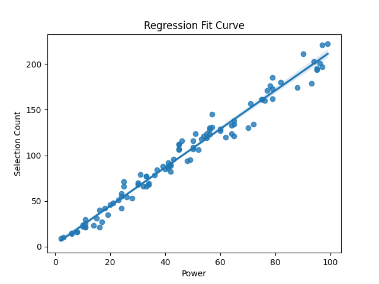
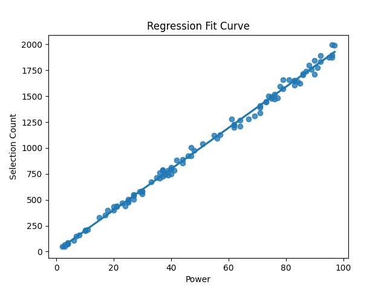
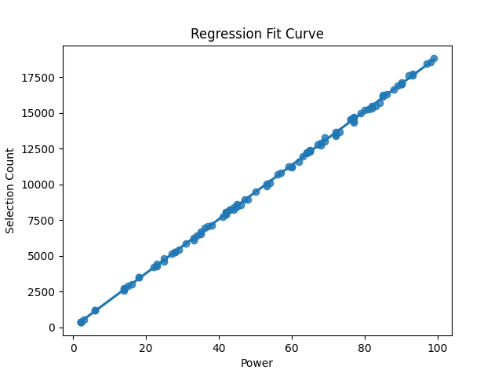

# VRF-Based Weighted Random Selection

This repository contains an implementation of a Verifiable Random Function (VRF) in Rust, used for weighted random selection among a list of candidates. Each candidate has a unique Ethereum address and a corresponding power (weight), determining their likelihood of being selected.

## Features

- **VRF Implementation**: Utilizes Elliptic Curve Cryptography for generating verifiable random outputs.
- **Weighted Random Selection**: Candidates are selected based on their assigned powers, with higher power increasing the chance of selection.
- **Ethereum Address Support**: Candidates are identified by Ethereum addresses.

## Getting Started

### Prerequisites

- Rust programming environment
- Cargo, Rust's package manager

### Installation

Clone the repository to your local machine:

```bash
git clone git@github.com:utnet-org/uvrf.git
cd uvrf
```

### Build the Project

Use Cargo to build the project:

```bash
cargo build
```


### Running Tests

To run tests, use the following Cargo command:

```bash
cargo test
```
## Usage

The main functionalities include key pair generation for VRF, computation of VRF, and the verification of the VRF output. Additionally, the repository provides functionality to read a list of candidates from a JSON file and select one based on their weighted power.

### Key Pair Generation

```rust
let (sk, pk) = generate_key_pair();
```
### Compute VRF

```rust
let vrf_output = compute_vrf(&sk, input);
```

### Verify VRF

```rust
let is_valid = verify_vrf(&pk, input, &vrf_output);
```

### Selecting a Candidate

Candidates are stored in a JSON file in the following format:

```json
[
    {"address": "0x123...", "power": 2},
    {"address": "0x456...", "power": 5},
    ...
]
```

To select a candidate:

```rust
let candidates = read_candidates_from_file("path/to/candidates.json").unwrap();
let selected_candidate = choose_candidate_vrf(&candidates, random_number);
```

To output the candidate with random number:
```bash
cargo test -- --nocapture test_vrf_random_selection_from_file
```
The --nocapture flag is used with cargo test to allow the print statements to be displayed on the console. By default, cargo test captures output from test functions, and this flag disables that behavior.

## Regression Fit Curves

Here are the regression fit curves generated from the mock data:


<p align="center">Tesing in 10,000 times</p>



<p align="center">Tesing in 100,000 times</p>



<p align="center">Tesing in 1M times</p>

## Contributing
Contributions to this project are welcome! Please feel free to submit issues and pull requests.

## License
This project is licensed under the MIT License - see the LICENSE file for details.


